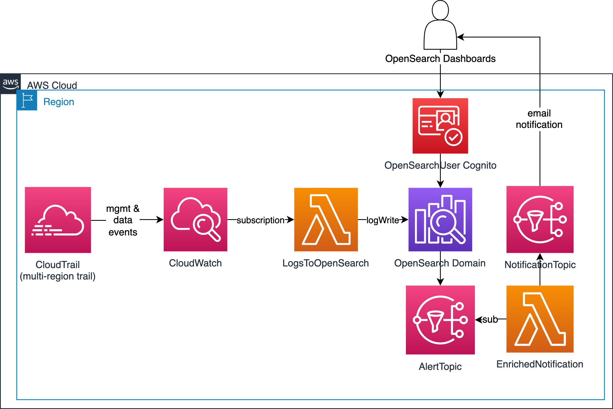
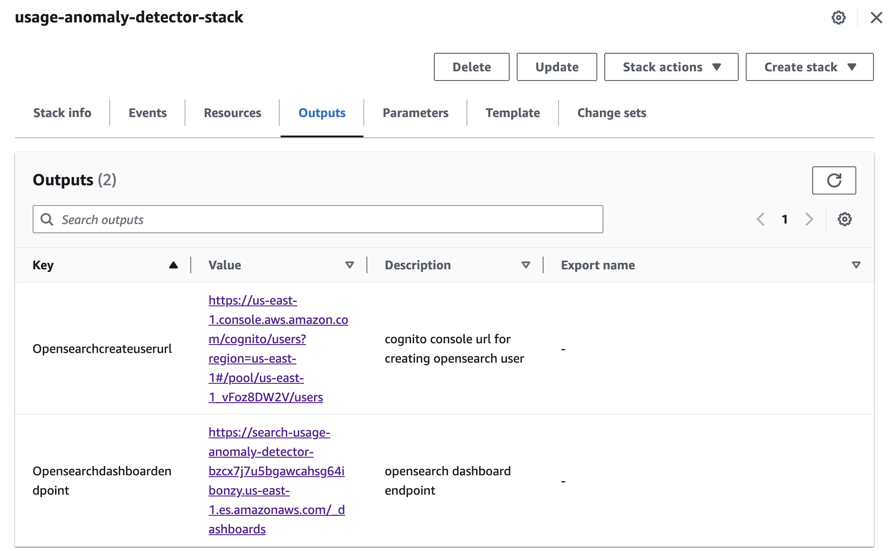
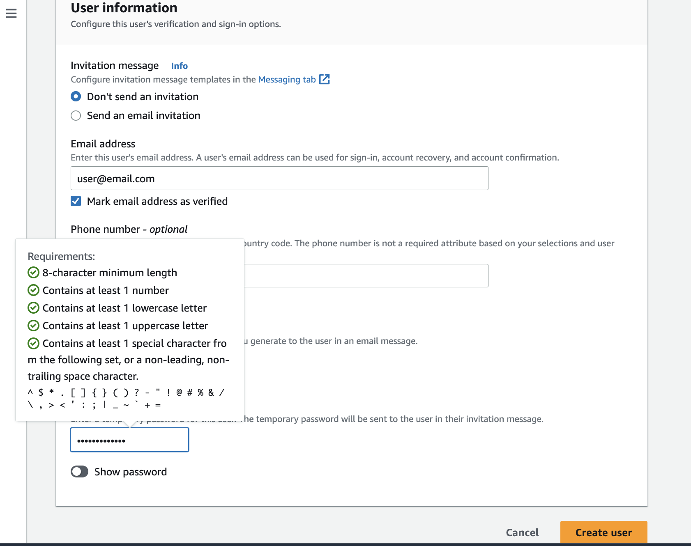
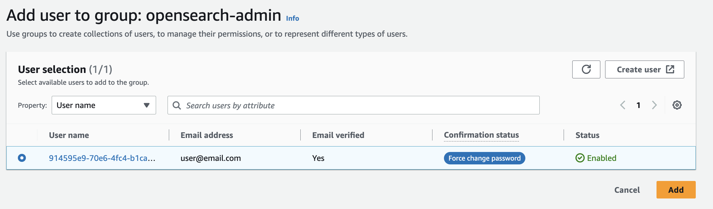
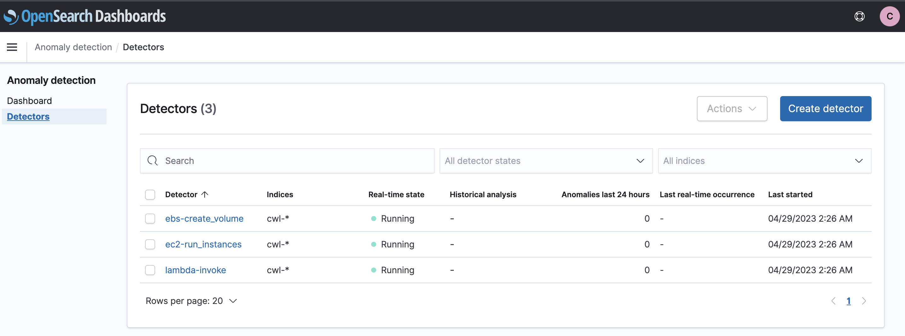
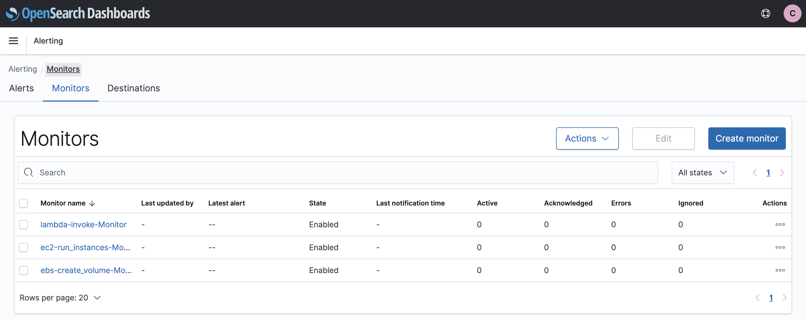
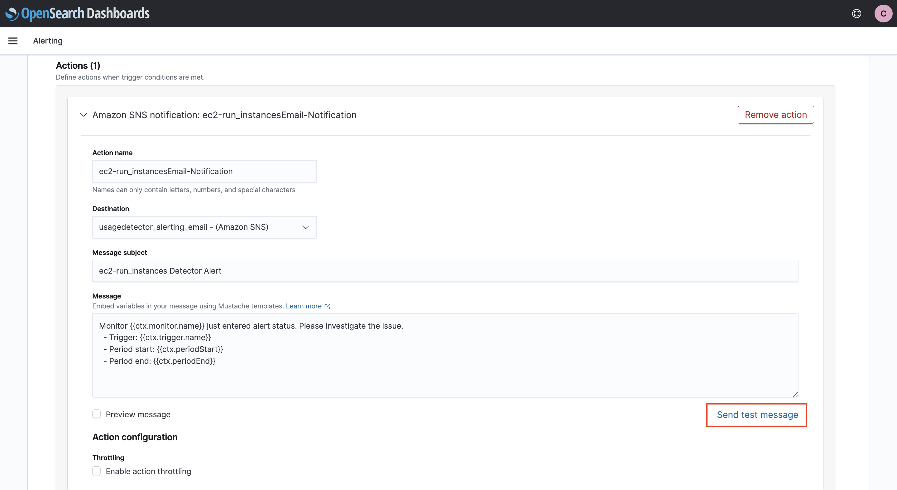
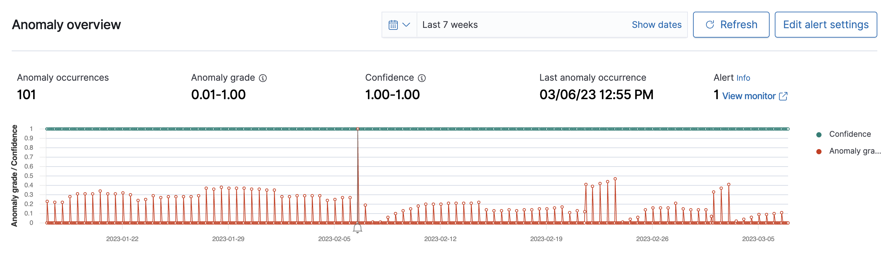
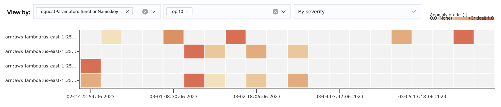
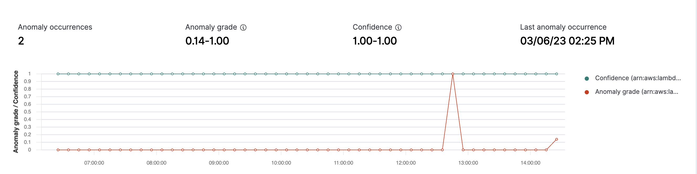

# Near-Real Time Usage Anomaly Detection using OpenSearch

Detecting usage anomalies promptly is crucial because they can result in unforeseen charges. The Near-Real Time Usage Anomaly Detection solutions offers the capabilities to address this issue effectively. 

Anomalies often manifest as an unusual number of invocations (known as spikes) of specific AWS APIs that involve provisioning or running AWS resources. Such anomalies can occur due to unintentional errors, such as a Lambda function stuck in a loop, or due to malicious activities like the use of leaked keys to create expensive GPU instances for cryptocurrency mining.

This solution leverages the [OpenSearch Anomaly Detection](https://docs.aws.amazon.com/opensearch-service/latest/developerguide/ad.html) feature to ingest in real-time CloudTrail management and data events and evaluate anomalies on specific API calls.

Currently this solution evaluates anomalies for 3 APIs. The target APIs are: 
- EC2 [RunInstances](https://docs.aws.amazon.com/AWSEC2/latest/APIReference/API_RunInstances.html)
- EC2 EBS [CreateVolume](https://docs.aws.amazon.com/AWSEC2/latest/APIReference/API_CreateVolume.html)
- Lambda [Invoke](https://docs.aws.amazon.com/lambda/latest/dg/API_Invoke.html)

The number of monitored APIs can be easily extended and we look forward to receive feedback from the community for further APIs to add. We also welcome contributions.

This solution provides a range of features that can be easily adapted and tailored to suit your individual requirements, including:

1. Configuration of OpenSearch and Cognito integration via CDK
2. Implementation of both high-cardinality and low-cardinality anomaly detection techniques
3. Ingestion of CloudTrail logs into OpenSearch in real-time
4. Development of custom dashboards using CloudTrail events
5. How to programmatically setup OpenSearch anomaly detectors and alerts through CDK
6. Dynamic enrichment of anomaly notifications with contextual information via a Lambda function

## Architecture


> NOTE: OpenSearch is deployed as public access domain and authentication is implemented via AWS Cognito. You should deploy OpenSearch inside a VPC if you want to limit access to private routes only.

The primary components of the solution's architecture are:

- AWS CloudTrail events centralized in an Amazon CloudWatch Logs log group.
- Amazon CloudWatch Logs log group data streaming to the Amazon OpenSearch domain in near real-time, facilitated by the LogsToOpenSearch Lambda function.
- OpenSearch Anomaly Detection module configured to detect usage anomalies in the ingested CloudTrail API calls.
- OpenSearch Alerting plugin responsible for dispatching alerts to customers for verification and remediation through the SNS AlertTopic.
- EnrichedNotification Lambda function, which enriches the alerts before sending them to the end user via the NotificationTopic.
- OpenSearch Dashboards access enabled by user authentication through the OpenSearchUser Cognito.

## Pre-requisites
- [AWS Cloud Development Kit](https://docs.aws.amazon.com/cdk/v2/guide/home.html) version 2.69 or higher.
-  All required libraries installed using python pip. Below commands are run locally from the root of the repository.

    ```
    pip install -r requirements.txt
    pip install -r shared/python/requirements.txt -t shared/python 
    ```  
The above commands will also download the python libraries for the lambda layer.

## Deployment
- Deploy the stack:  

    ```
    cdk deploy --parameters opensearchAlertEmail='<your-alert-mailing-list@email.com>'
    ```

This will do the following in the target account : 
1. Create CloudTrail trails with target CloudWatch log-group for the trails.
2. Create OpenSearch Domain with Cognito auth for user management.
3. Setup Cloudwatch subscription filter (using Lambda) to forward logs to OpenSearch.
4. Create Lambda functions for Opensearch configuration automation(IAM Role mapping, anomaly detector creation).
5. Create SNS topics for alerts and notification lambda for enriched notifications.  

> NOTE: The IAM roles use AWS ManagedPolicies for various cases like lambdaExecution, etc. If required, please update to use self managed policies.  

You can set the context to disable Lambda logging with the trail by setting: `--context enable-lambda-trail=false`. This will skip the Lambda Anomaly detector creation.  

Furthermore, please examine the notification subscription confirmation email delivered to `<your-alert-mailing-list@email.com>` and confirm your subscription in order to obtain alert emails.

## Usage
Once the deployment process concludes, the output from the CDK stack offers essential links for utilizing the solution.  
Two primary URLs will be accessible: one for the OpenSearch dashboard endpoint and another for the Cognito user creation. Additionally, these URLs can be located within the Outputs tab of the CloudFormation console, as demonstrated in the example provided below:


- Use the `OpenSearchCreateUserUrl` link (or navigate to the Cognito user pool in the AWS console) to create a new user to access the OpenSearch Dashboard. You can choose to make the user verified or send an invitation, as in the example shown below and then click **Create user**.
  
- The user by default does NOT have access to the OpenSearch security management permissions. If you want to provide full access control, please add the user to the `opensearch-admin` group:  
  

- To access the OpenSearch Dashboard, either use the `OpenSearchDashboardEndpoint` URL or proceed to the corresponding URL within the OpenSearch Service section of the AWS Console.  
- Inspect the `cwl-*` index pattern found in the Discover section to view all CloudTrail logs.
- Explore the Dashboard section to find resource usage dashboards for EC2, EBS, Lambda, and insights derived from CloudTrail events. View example dashboard images [here](images/dashboard/).
- Examine the **Anomaly Detection > Detectors** section to discover anomaly detectors associated with EC2 RunInstances, EBS CreateVolume, and Lambda Invoke API calls:  
  

The anomaly detectors will send an email notification based on detected anomalies, for details check section below.  
If you want to send a test notification, follow the steps:  
1. In the OpenSearch Dashboard, navigate to **Alerting > Monitors** and click on monitor for which you wish to send the test notification:  
  
2. Click **Edit** and scroll down to **Triggers > Actions** and click **Send test message**:  



## Anomaly Detection
Amazon OpenSearch Service supports a highly performant, integrated anomaly detection engine that enables near real-time identification of anomalies in streaming data. Anomaly detection in Amazon OpenSearch Service automatically detects anomalies in your OpenSearch data in near-real time by using the Random Cut Forest (RCF) algorithm. RCF is an unsupervised machine learning algorithm that models a sketch of your incoming data stream. The algorithm computes an anomaly grade and confidence score value for each incoming data point. Anomaly detection uses these values to differentiate an anomaly from normal variations in your data.  

For EC2, we use anomaly detector on RunInstance API call which provisions EC2s. An example anomaly detection can be seen below:  


For Lambda, we are using [high-cardinality anomaly detection](https://aws.amazon.com/blogs/big-data/a-deep-dive-into-high-cardinality-anomaly-detection-in-elasticsearch/).  
Check below screenshot for example anomaly:  
  


## Security

See [CONTRIBUTING](CONTRIBUTING.md#security-issue-notifications) for more information.

## License

This library is licensed under the MIT-0 License. See the LICENSE file.
