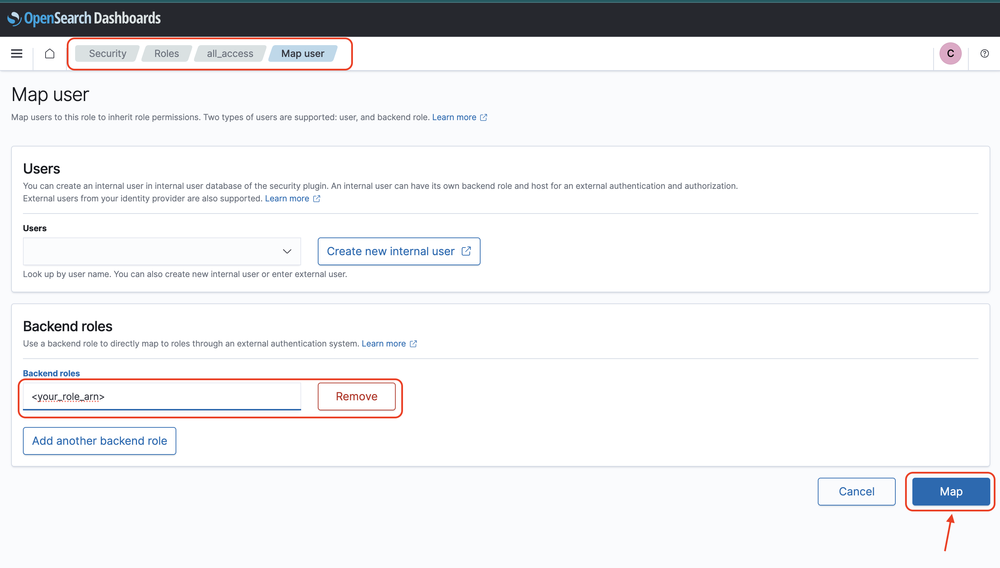

## Usage Anomaly Detection Deployment on existing OpenSearch Domain

For deploying the solution to an existing OpenSearch domain, provide an IAM role with permissions to access the domain and basic AWS Lambda execution permissions.  
Please follow below steps for creating the role and setting permissions:  
1. Create role and add AWS Lambda execution permissions:  
    ```
    export USAGE_ANOMALY_DETECTION_IAM_ROLE_NAME="<role_name>"

    aws iam create-role --role-name $USAGE_ANOMALY_DETECTION_IAM_ROLE_NAME --assume-role-policy-document '{"Version": "2012-10-17","Statement": [{ "Effect": "Allow", "Principal": {"Service": "lambda.amazonaws.com"}, "Action": "sts:AssumeRole"}]}'

    aws iam attach-role-policy --role-name $USAGE_ANOMALY_DETECTION_IAM_ROLE_NAME  --policy-arn arn:aws:iam::aws:policy/service-role/AWSLambdaBasicExecutionRole
    ```
2. Map the IAM role arn in the OpenSearch all_access backend role, as shown in the screenshot below:  


Once done, run the cdk deploy command given in the [readme](./README.md) file with the above IAM role arn and the target OpenSearch domain endpoint.